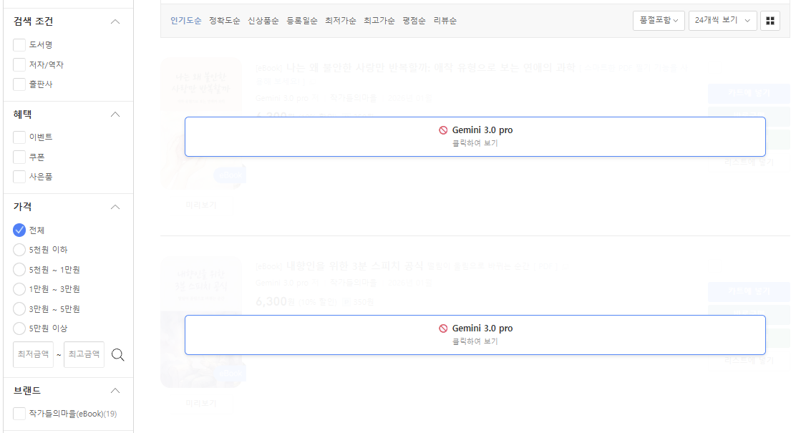
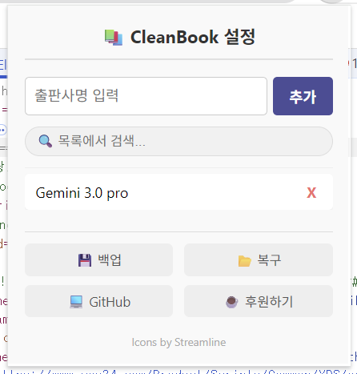

# 📚 CleanBook

**CleanBook**은 교보문고, 알라딘, Yes24에서 원치 않는 출판사나 저자의 책을 검색 결과와 리스트에서 가려주는 Chrome 확장 프로그램입니다.

👉 **[Chrome 웹 스토어 바로가기](https://chromewebstore.google.com/detail/aimjhnflkobjkaiahlaidmpailejaoki?utm_source=item-share-cb)**

 

## 🧐 왜 필요한가요?

특정 키워드 검색 시, 양산형 도서나 원치 않는 출판사의 책이 페이지 전체를 뒤덮어 탐색을 방해하는 경우가 있습니다. CleanBook은 이러한 도서들을 시각적으로 차단하여 쾌적한 검색 환경을 만들어줍니다.

<b>실제 차단 적용 화면 보기</b>

 

*(실제 'gemini 3.0 pro'키워드가 차단 필터에 의해 가려진 모습)*

 

## 📸 실행 화면

### 1. 정밀 필터링 (Before & After)
책 제목이 아닌, **출판사와 저자명**만을 분석하여 정확하게 차단합니다.

| 적용 전 (Before) | 적용 후 (After) |
| :---: | :---: |
|  |  |

### 2. 관리자 팝업 (Popup UI)
차단 키워드를 손쉽게 추가/삭제하고, 데이터를 백업할 수 있습니다.

 

## 📌 주요 기능

* **국내 3대 서점 지원:** 교보문고(eBook 포함), 알라딘(저자 검색 포함), Yes24 완벽 지원
* **오차단 방지:** 단순 텍스트 매칭이 아닌 DOM 구조 분석 및 URL 추적(`PublisherSearch` 등)을 통한 정밀 타겟팅
* **가림막 UI:** 아예 삭제하는 대신 '차단됨' 가림막을 씌워, 필요시 클릭하여 내용을 확인할 수 있는 제어권 제공
* **데이터 관리:** JSON 파일 형식의 설정 백업 및 복구 기능 지원

 

## 📂 개발 과정 & 기술 문서

이 프로젝트는 3일간의 집중 개발(Sprint)을 통해 완성되었으며, 이후 지속적인 업데이트를 통해 기능(Yes24, eBook 지원 등)을 확장했습니다. 
상세한 개발 과정과 기술적 의사결정 기록은 별도의 **dev-notes** 저장소에서 확인하실 수 있습니다.

> **[📄 dev-notes 저장소 바로가기](https://github.com/hyunjyyyy/dev-notes)**

* **01_context.md**: 프로젝트 기획 배경 및 목표
* **02_problem-observations.md**: 사이트별 구조적 문제 분석 (DOM 파편화 등)
* **03_decision-log.md**: MutationObserver 및 Bottom-Up 탐색 방식 도입 이유
* **04_tradeoffs.md**: 정밀도와 성능 사이의 트레이드오프
* **05_learnings.md**: 프로젝트 회고 및 배운 점

 

## 🛠 설치 및 사용 방법

1.  **설치:** [Chrome 웹 스토어](https://chromewebstore.google.com/detail/aimjhnflkobjkaiahlaidmpailejaoki?utm_source=item-share-cb)에서 'Chrome에 추가' 버튼 클릭
2.  **설정:** 브라우저 우측 상단 🧩 아이콘 클릭 → CleanBook 실행
3.  **등록:** 차단하고 싶은 **출판사명** 또는 **저자명** 입력 후 엔터
4.  **확인:** 서점 사이트 새로고침 시 즉시 적용

 

## 🎨 License

* **Developer:** Hyunji Yu
* **Icons:** [Streamline](https://streamlinehq.com)
* Copyright © 2026 CleanBook. All rights reserved.